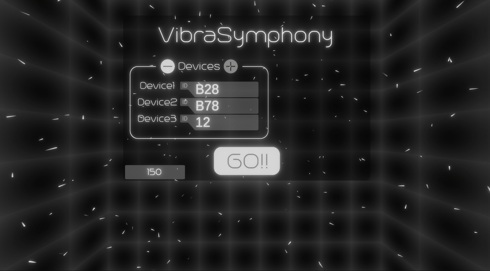

# Vibra Symphony

---

## プロジェクトの内部システムについて

VibraSymphonyの内部システムおよびプログラム設計を紹介する目的で、  
非商用かつ簡易的なバージョンを別リポジトリにて公開しています：

 **[VibraSymphony_Core リポジトリ](https://github.com/rickyKunn/VibraSymphony_Core/)**  
 (プログラムのみ／簡易アセット使用）

このバージョンには以下が含まれています：
- VibraSymphonyのコアロジック、システム実装
- オリジナルの3DモデルやVFX、音声等は含まれていません
- ポートフォリオ目的での閲覧専用です

## プロジェクト概要

**Vibra Symphony** は、VR ライブ鑑賞体験を拡張するリアルタイムフィードバックシステムです。  
ライブ音源をアプリ内で FFT（高速フーリエ変換）解析し、ドラムやベースなどのビートに合わせてスマートフォンを振動させることで、**聴覚と触覚**を融合します。

---

## デモ画像

  

---

## 主な機能

- **Android アプリ**  
  - ローカルストレージ内の MP3 ファイルを一覧表示  
  - 選択した MP3 を TCP/IP ソケットで Oculus Quest にストリーム送信  
- **VR 会場モデリング & 自由移動**  
  - **Blender** で作成した 3D ライブステージと観客席  
  - Oculus Quest のスティックで会場内を自由に歩行・移動可能  
- **リアルタイム FFT 解析 & ビート検出**  
  - Unity C# `OnAudioFilterRead` + FFT でドラム／ベースのピークを検出  
- **OSC 通信によるビート通知**  
  - ドラム／ベース検出時に OSC通信 で Android に高速通知  
- **スマホ振動制御**  
  - Android 側で OSC 受信 → `Vibrator` API による振動パターン再生  
- **360° VR ライブ鑑賞 UX**  
  - Oculus Quest で 360° 映像と空間音響を再生  
  - ビートに同期したカメラエフェクト・Haptics  
---

## 使用技術

- **VR プロジェクト**  
  - Unity
  - **モデリング**：Blender（会場・ステージ・観客席）  
  - **アニメーション**：モーションキャプチャーデータ（BVH/FBX）  
  - **移動制御**：
    - Unity Character Controller による歩行シミュレーション  
  - **音声解析**：Unity C# `OnAudioFilterRead` ＋ FFT 分析
   - **MP3 送信**：TCP/IP
  - **振動データ送信**：UDP/IP
  - **その他通信**：TCP/IP 
  - **振動**：Android `Vibrator` API  
---

## ライセンスおよびクレジット
 
本プロジェクトでは、ユニティ・テクノロジーズ・ジャパンが提供する「Unity-Chan」キャラクターおよび関連アセットを使用しています。  
使用にあたっては、以下のライセンスに従っています：  
🔗 [Unity-Chan ライセンス（日本語）](https://unity-chan.com/contents/license_jp/)  
🔗 [Unity-Chan License (English)](https://unity-chan.com/contents/license_en/)

© 2025 小林立樹  
© Unity Technologies Japan / Unity-Chan Project. All rights reserved.
